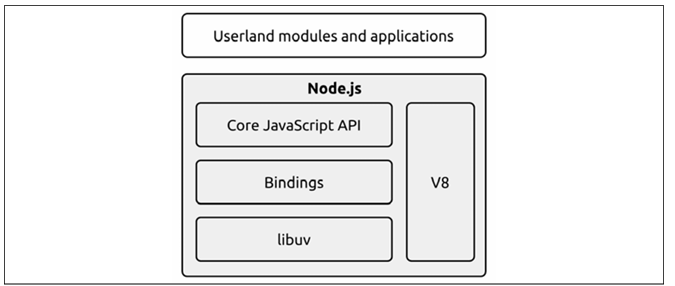

# Libuv, the I/O engine of Node.js

Each operating system has its own interface for the event demultiplexer

Libuv is a level of abstraction that provides a consistent API for handling event demultiplexing across different operating systems.

Libuv represents the low-level I/O engine of Node.js and is probably the most important component that Node.js is built on.

libuv also implements the reactor pattern, thus providing an API for creating event loops, managing the event queue, running asynchronous I/O operations, and queuing other types of task.

## The recipe for Node.js

The reactor pattern and libuv are the basic building blocks of Node.js, but we need three more components to build the full platform:

- A set of bindings responsible for wrapping and exposing libuv and other low-level functionalities to JavaScript.
- V8, the JavaScript engine originally developed by Google for the Chrome browser. This is one of the reasons why Node.js is so fast and efficient. V8 is acclaimed for its revolutionary design, its speed, and for its efficient memory management.
- A core JavaScript library that implements the high-level Node.js API.

