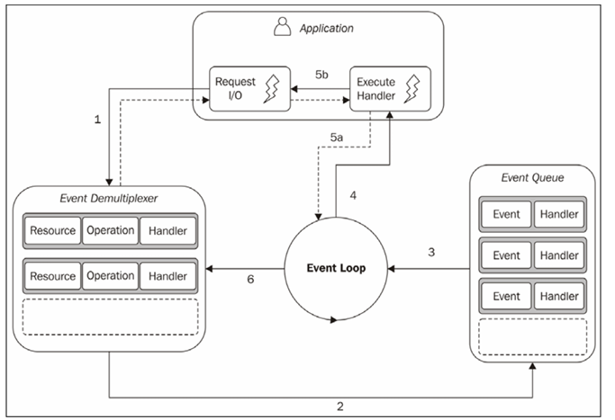

# Reactor Pattern

The main idea behind the reactor pattern is to have a handler associated with each I/O operation.

A handler in Node.js is represented by a callback (or cb for short) function.The handler will be invoked as soon as an event is produced and processed by the event loop.

1. The application generates a new I/O operation by submitting a request to  the Event Demultiplexer. The application also specifies a handler, which will be invoked when the operation completes. Submitting a new request to the Event Demultiplexer is a non-blocking call and it immediately returns  control to the application.
2. When a set of I/O operations completes, the Event Demultiplexer pushes a set of corresponding events into the Event Queue.
3. At this point, the Event Loop iterates over the items of the Event Queue.
4. For each event, the associated handler is invoked.
5. The handler, which is part of the application code, gives back control to the Event Loop when its execution completes (5a). While the handler executes, it can request new asynchronous operations (5b), causing new items to be added to the Event Demultiplexer (1).
6. When all the items in the Event Queue are processed, the Event Loop blocks again on the Event Demultiplexer, which then triggers another cycle when a new event is available.

The asynchronous behavior has now become clear. The application expresses interest in accessing a resource at one point in time (without blocking) and provides a handler, which will then be invoked at another point in time when the operation completes.

The reactor pattern: Handles I/O by blocking until new events are available from a set of observed resources, and then reacts by dispatching each event to an associated handler.
