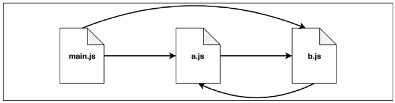

# CommonJS

CommonJS is the first module system originally built into Node.js. Node.js CommonJS implementation respects the CommonJS specification, with the addition of some custom extensions.

Let's summarize two of the main concepts of the CommonJS specification:

- require is a function that allows you to import a module from the local filesystem
- exports and module.exports are special variables that can be used to export public functionality from the current module

## A Homemade Module Loader

Let's start by creating a function that loads the content of a module, wraps it into a private scope, and evaluates it:

```javascript
function loadModule(filename, module, require) {
  const wrappedSrc = `(function (module, exports, require) {
${fs.readFileSync(filename, "utf8")}
})(module, module.exports, require)`;
  eval(wrappedSrc);
}
```

The source code of a module is essentially wrapped into a function, as it was for the revealing module pattern.

we are using `readFileSync` (Synchronous operation), This approach makes sure that, if we are importing multiple modules, they (and their dependencies) are loaded in the right order.

the `require()` function

```javascript
function require(moduleName) {
  console.log(`Require invoked for module: ${moduleName}`);
  const id = require.resolve(moduleName); // (1)
  if (require.cache[id]) {
    // (2)
    return require.cache[id].exports;
  }
  // module metadata
  const module = {
    // (3)
    exports: {},
    id,
  };
  // Update the cache
  require.cache[id] = module; // (4)
  // load the module
  loadModule(id, module, require); // (5)
  // return exported variables
  return module.exports; // (6)
}
require.cache = {};
require.resolve = (moduleName) => {
  /* resolve a full module id from the moduleName */
};
```

1. A module name is accepted as input, and the very first thing that we do is resolve the full path of the module, which we call id. This task is delegated to require.resolve(), which implements a specific resolving algorithm
2. If the module has already been loaded in the past, it should be available in the cache. If this is the case, we just return it immediately.
3. If the module has never been loaded before, we set up the environment for the first load. In particular, we create a module object that contains an exports property initialized with an empty object literal. This object will be populated by the code of the module to export its public API.
4. After the first load, the module object is cached.
5. The module source code is read from its file and the code is evaluated, as we saw before. We provide the module with the module object that we just created, and a reference to the `require()` function. The module exports its public API by manipulating or replacing the module.exports object.
6. Finally, the content of module.exports, which represents the public API of the module, is returned to the caller.

when you do this:

```javascript
exports = {
  foo: () => console.log("foo"),
  bar: () => console.log("bar"),
};
```

in your module, you just do nothing as we pass reference to `module.exports` to the module, and you just make the `exports` reference to something else (broke the reference).

and we return `module.exports`, not exports itself, So assigning to `exports` will not work, and if you complete by assigning objects to exports (e.g. `exports.foo = {}` ) you break exports reference to `module.exports`.

so `module.exports` if you assign it you will only export this object, if you add properties to it (e.g. `exports.foo = {}` ), you will export these properties.

## The Resolving Algorithm

The term **dependency hell** describes a situation whereby two or more dependencies of a program in turn depend on a shared dependency, but require different incompatible versions.

Node.js solves this problem elegantly by loading a different version of a module depending on where the module is loaded from.

The resolving algorithm can be divided into the following three major branches:

- **File modules**: If moduleName starts with /, it is already considered an absolute path to the module and it's returned as it is. If it starts with ./, then moduleName is considered a relative path, which is calculated starting from the directory of the requiring module.
- **Core modules**: If moduleName is not prefixed with / or ./, the algorithm will first try to search within the core Node.js modules.
- **Package modules**: If no core module is found matching moduleName, then the search continues by looking for a matching module in the first node_modules directory that is found navigating up in the directory structure starting from the requiring module. The algorithm continues to search for a match by looking into the next node_modules directory up in the directory tree, until it reaches the root of the filesystem.

For file and package modules, both files and directories can match moduleName. In particular, the algorithm will try to match the following:

- `moduleName`.js
- `moduleName`/index.js
- The directory/file specified in the main property of `moduleName`/package.json

The node_modules directory is actually where the package managers install the dependencies of each package.

each package can have its own private dependencies. For example:

```bash
myApp
├── foo.js
└── node_modules
├── depA
│ └── index.js
├── depB
│ ├── bar.js
│ └── node_modules
│ └── depA
│ └── index.js
└── depC
├── foobar.js
└── node_modules
└── depA
└── index.js
```

In the previous example, myApp, depB, and depC all depend on depA. However, they all have their own private version of the dependency! Following the rules of the resolving algorithm, using require('depA') will load a different file depending on the module that requires it, for example:

- Calling require('depA') from /myApp/foo.js will load /myApp/node_modules/depA/index.js

- Calling require('depA') from /myApp/node_modules/depB/bar.js will load /myApp/node_modules/depB/node_modules/depA/index.js

- Calling require('depA') from /myApp/node_modules/depC/foobar.js will load /myApp/node_modules/depC/node_modules/depA/index.js

## The Module Cache

Caching is crucial for performance, but it also has some important functional implications:

- It makes it possible to have cycles within module dependencies
- It guarantees, to some extent, that the same instance is always returned when requiring the same module from within a given package.

The module cache is exposed via the require.cache variable, so it is possible to directly access it if needed.

A common use case is to invalidate any cached module by deleting the relative key in the require.cache variable, a practice that can be useful during testing but very dangerous if applied in normal circumstances.

## Circular Dependencies



here main depends on a and b, a depends on b, and b depends on a (circular dependency).

given this example:

module a.js:

```javascript
exports.loaded = false;
const b = require("./b");
module.exports = {
  b,
  loaded: true, // overrides the previous export
};
```

module b.js:

```javascript
exports.loaded = false;
const a = require("./a");
module.exports = {
  a,
  loaded: true,
};
```

module main.js:

```javascript
const a = require("./a");
const b = require("./b");
console.log("a ->", JSON.stringify(a, null, 2));
console.log("b ->", JSON.stringify(b, null, 2));
```

when you run main.js, you will get:

```bash
a -> {
  "b": {
    "a": {
      "loaded": false
    },
    "loaded": true
  },
  "loaded": true
}
b -> {
  "a": {
    "loaded": false
  },
  "loaded": true
}
```
